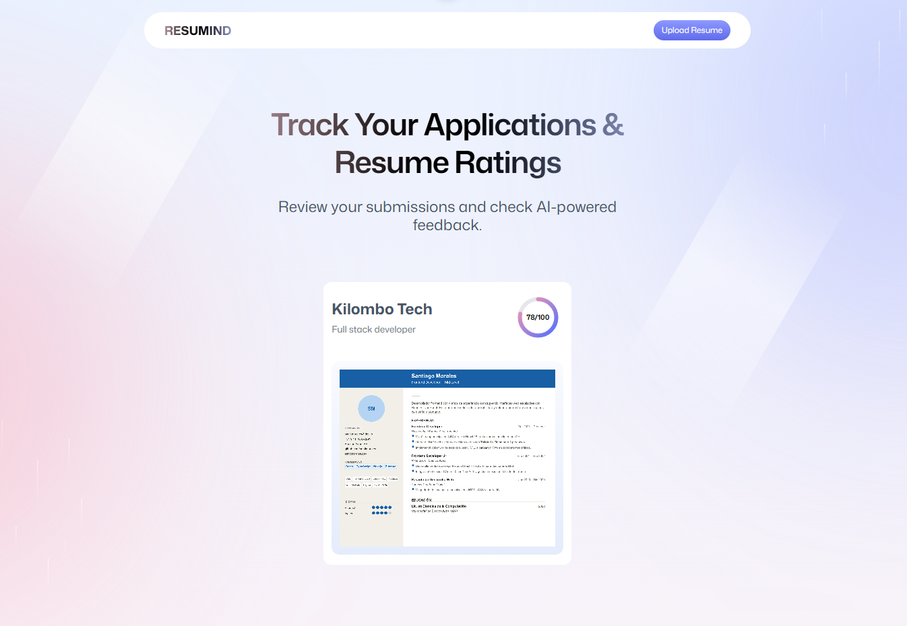
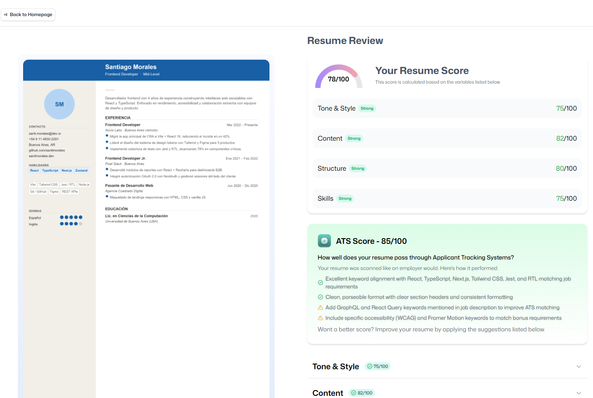
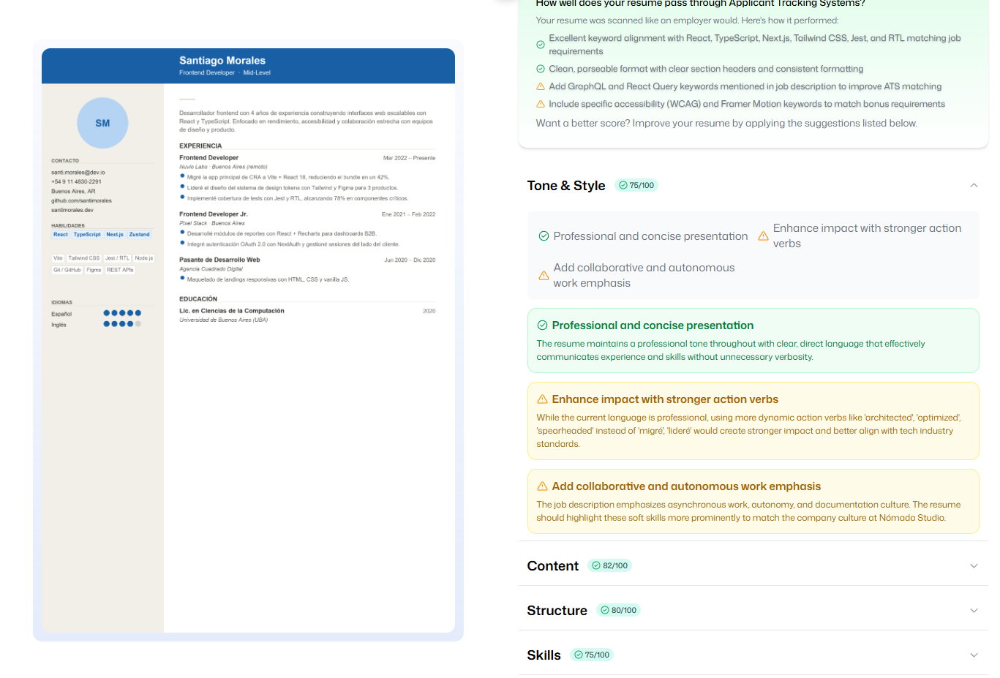

# Resumind - AI-Powered Resume Analyzer

An intelligent resume analysis platform that leverages AI to provide comprehensive feedback on your
resume's effectiveness. Upload your resume, add job details, and receive detailed insights on ATS
compatibility, tone, structure, content quality, and more.

## 🎯 Live Deployment

**Live Application:** https://puter.com/app/app-resumid

The application is fully deployed on **Puter**, a cloud-based platform that provides seamless file
storage, AI capabilities, and web app hosting.

## 📋 Features

- **Smart Resume Analysis**: Upload your resume in PDF format and receive AI-powered feedback
- **ATS Compatibility Scoring**: Check if your resume is optimized for Applicant Tracking Systems
- **Multi-Dimensional Feedback**:
    - Overall score and rating
    - ATS optimization score and tips
    - Tone and style analysis
    - Content quality assessment
    - Structure and formatting evaluation
    - Skills section analysis
- **Job Context Analysis**: Provide company name and job description for tailored recommendations
- **Visual Feedback**: Interactive score gauges and detailed breakdowns
- **Cloud Storage**: All your resumes are securely stored in Puter's cloud storage
- **Authentication**: Secure user authentication via Puter
- **Data Management**: Ability to manage and clear your stored resume data

## 📸 Screenshots

### Home Dashboard

The dashboard displays all your uploaded resumes with their overall scores. Users can easily
navigate to upload new resumes or review previous analyses.



**Features visible:**

- Navigation bar with upload button
- Title: "Track Your Applications & Resume Ratings"
- Resume cards showing company name, job title, and overall score
- Quick access to view detailed feedback

### Detailed Resume Analysis

After uploading and analyzing a resume, users receive a comprehensive breakdown across multiple
dimensions with actionable recommendations.

<p align="center">
    
    
</p>

**Features visible:**

- Resume preview on the left side
- Overall resume score (78/100)
- Category-based scores:
    - Tone & Style (75/100)
    - Content (82/100)
    - Structure (80/100)
    - Skills (75/100)
- ATS Score with specific recommendations
- Expandable sections for detailed feedback on each category
- "Back to Homepage" navigation

---

## 🛠 Technology Stack

### Frontend

- **React 19.2.6** - Modern UI library with latest hooks and features
- **React Router 7.15.1** - Full-stack routing with server-side rendering
- **TypeScript 5.9.3** - Static typing for improved code quality and developer experience
- **Tailwind CSS 4.3.0** - Utility-first CSS framework for rapid UI development
- **Vite 8.0.3** - Lightning-fast build tool and development server

### Backend & Infrastructure

- **React Router Node Server** (@react-router/node 7.15.1) - Built-in Node.js server for backend
  operations
- **React Router Serve** (@react-router/serve 7.15.1) - Production-ready server runner

### Key Libraries

- **Puter SDK** - Integration with Puter platform for:
    - File system operations (PDF uploads, storage)
    - AI capabilities (resume analysis using Claude/GPT)
    - Key-value store (data persistence)
    - User authentication
- **Zustand 5.0.13** - Lightweight state management for React
- **PDF.js (pdfjs-dist 5.7.284)** - PDF parsing and rendering
- **React Dropzone 15.0.0** - File drag-and-drop functionality
- **clsx 2.1.1** - Conditional CSS class utilities
- **tailwind-merge 3.6.0** - Merge Tailwind CSS classes intelligently

### Development Tools

- **@tailwindcss/vite 4.3.0** - Tailwind CSS Vite integration
- **@types packages** - Type definitions for React, Node.js, and React DOM
- **pnpm 11.1.2** - Fast, disk space-efficient package manager

## 🚀 Deployment Architecture

The application is deployed on **Puter**, a cloud-based platform that provides:

- **Serverless Backend**: All backend operations run through React Router's Node server
- **Cloud File Storage**: PDF files and resume data stored in Puter's distributed file system
- **Integrated AI Engine**: AI analysis powered by Puter's AI capabilities
- **Automatic Scaling**: Infrastructure handles traffic scaling automatically
- **Security**: Built-in authentication and secure data handling

### Deployment Details

- **Platform**: Puter (https://puter.com)
- **App URL**: https://puter.com/app/app-resumid
- **Runtime**: Node.js with React Router Server
- **Build Output**: Full-stack SSR bundle with client and server code

## 📁 Project Structure

```
resumind/
├── app/
│   ├── components/          # React components
│   │   ├── Accordion.tsx    # Expandable sections
│   │   ├── ATS.tsx          # ATS scoring display
│   │   ├── Details.tsx      # Detailed feedback cards
│   │   ├── FileUploader.tsx # PDF upload component
│   │   ├── Navbar.tsx       # Navigation bar
│   │   ├── ResumeCard.tsx   # Resume card display
│   │   ├── ScoreCircule.tsx # Circular score display
│   │   ├── ScoreGauge.tsx   # Gauge chart component
│   │   └── Summary.tsx      # Summary view
│   ├── routes/              # Page routes
│   │   ├── auth.tsx         # Authentication page
│   │   ├── home.tsx         # Home/dashboard page
│   │   ├── upload.tsx       # Resume upload & analysis
│   │   ├── resume.tsx       # Resume details view
│   │   └── wipe.tsx         # Data cleanup page
│   ├── lib/                 # Utility functions
│   │   ├── pdf2img.ts       # PDF to image conversion
│   │   ├── puter.ts         # Puter SDK integration
│   │   └── utils.ts         # General utilities
│   ├── constants/           # App constants and types
│   ├── types/               # TypeScript type definitions
│   ├── root.tsx             # Root layout component
│   └── app.css              # Global styles
├── public/                  # Static assets
├── build/                   # Production build output
│   ├── client/              # Client-side assets
│   └── server/              # Server-side code
├── package.json             # Dependencies and scripts
├── tsconfig.json            # TypeScript configuration
├── vite.config.ts           # Vite configuration
├── react-router.config.ts   # React Router configuration
└── Dockerfile               # Docker containerization
```

## 📦 Routes & Pages

| Route         | Purpose                                      |
| ------------- | -------------------------------------------- |
| `/`           | Home page / Dashboard                        |
| `/auth`       | User authentication                          |
| `/upload`     | Resume upload and analysis interface         |
| `/resume/:id` | View detailed feedback for a specific resume |
| `/wipe`       | Clear stored resume data                     |

## 🚦 Getting Started

### Prerequisites

- Node.js 18+ or higher
- pnpm 11.1.2+ (recommended) or npm/yarn
- Puter account (for deployment)

### Installation

```bash
# Install dependencies
pnpm install
# or
npm install
```

### Development

Start the development server with hot module replacement:

```bash
pnpm dev
# or
npm run dev
```

The application will be available at `http://localhost:5173`

### Build for Production

```bash
pnpm build
# or
npm run build
```

This creates:

- `build/client/` - Static assets for distribution
- `build/server/` - Server-side code

### Type Checking

```bash
pnpm typecheck
# or
npm run typecheck
```

Generates route types and checks TypeScript errors.

### Start Production Server

```bash
pnpm start
# or
npm start
```

## 🐳 Docker Deployment

Build and run the application using Docker:

```bash
# Build the Docker image
docker build -t resumind .

# Run the container
docker run -p 3000:3000 resumind
```

The containerized app runs on `http://localhost:3000`

## 🌐 Deployment Platforms

The production-ready build can be deployed to:

- **Puter** (current deployment) - https://puter.com/app/app-resumid
- **AWS ECS** - Elastic Container Service
- **Google Cloud Run** - Serverless container platform
- **Azure Container Apps** - Managed container service
- **Digital Ocean App Platform** - Simplified app hosting
- **Fly.io** - Modern app deployment
- **Railway** - Infrastructure platform
- **Vercel** - Optimized for React Router projects

## 🔑 Key Features Explained

### Resume Upload & Processing

Users can upload PDF resumes which are:

1. Validated for correct format
2. Converted to images for preview
3. Processed by AI for comprehensive analysis
4. Stored securely in Puter's file system

### AI Analysis

The application uses Puter's integrated AI to evaluate resumes across multiple dimensions:

- **ATS Score (0-100)**: How well the resume passes automated screening
- **Tone Score (0-100)**: Professionalism and clarity of language
- **Content Score (0-100)**: Relevance and quality of information
- **Structure Score (0-100)**: Organization and formatting
- **Skills Score (0-100)**: Clarity and relevance of technical skills

### Contextual Feedback

By providing job title, company name, and job description, users receive:

- Tailored recommendations specific to the target position
- Suggestions for skill highlighting
- ATS optimization tips for that specific job posting

### Data Persistence

All analysis results are stored in Puter's key-value store, allowing users to:

- Review previous analyses
- Compare multiple resumes
- Track improvements over time

## 🔐 Security & Privacy

- **User Authentication**: Integrated with Puter's secure authentication system
- **Encrypted Storage**: Files stored securely in Puter's cloud infrastructure
- **Data Control**: Users can wipe all their data with the `/wipe` endpoint
- **TypeScript Safety**: Full type safety prevents runtime errors

## 📊 Performance Optimizations

- **Server-Side Rendering (SSR)**: Faster initial page loads
- **Code Splitting**: Lazy loading of routes and components
- **Asset Optimization**: Automatic bundling and minification
- **Tailwind CSS Purging**: Only included styles are shipped
- **Hot Module Replacement**: Instant updates during development

## 🎨 Styling

The application uses **Tailwind CSS 4.3.0** with custom animations from `tw-animate-css`. Key
styling features:

- Responsive design for all screen sizes
- Dark mode ready
- Custom color schemes
- Smooth transitions and animations
- Accessible UI components

## 🤝 Contributing

Contributions are welcome! Please feel free to submit pull requests or open issues for bugs and
feature requests.

## 📄 License

This project is created for learning and demonstration purposes.

## 🎓 Learning Project

This application was built as part of a learning initiative to explore:

- Full-stack React development with React Router
- Integration with cloud platforms (Puter)
- AI integration for practical use cases
- Modern TypeScript practices
- Production-ready deployment patterns

## 📞 Support

For issues related to:

- **Application**: Open an issue in the repository
- **Puter Platform**: Visit https://puter.com/support
- **React Router**: Check https://reactrouter.com/docs

---

**Built with modern web technologies and deployed on Puter for seamless, scalable resume analysis.**

**Live Application**: https://puter.com/app/app-resumid
